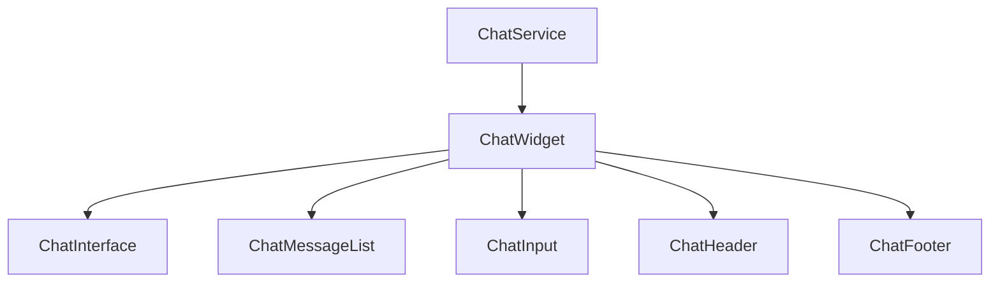
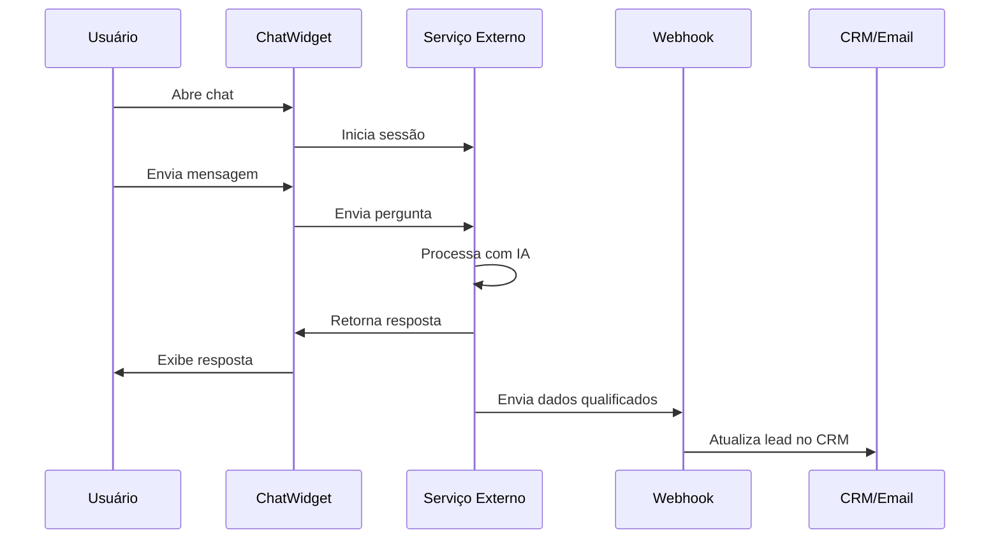

# Análise do Módulo Chat IA para Agile Gestão Empresarial

## 1. Visão Geral

Após uma análise completa do código-fonte e documentação do projeto Agile Gestão Empresarial, foi constatado que **não existe atualmente um módulo de chat IA implementado** no sistema. O projeto é uma landing page em Next.js com blog integrado, focado em geração de leads para os serviços de automação de restaurantes (Colibri) e contabilidade da Agile Gestão Empresarial.

## 2. Diagnóstico do Estado Atual

### 2.1. Componentes Existentes de Atendimento
O projeto atualmente possui os seguintes componentes relacionados ao atendimento ao cliente:

- **WhatsAppButton.tsx**: Botão flutuante para contato via WhatsApp
- **SmartContactForm.tsx**: Formulário de contato com validação
- **ContactSection.tsx**: Seção de contato com formulário e informações
- **Integrações de analytics**: Google Analytics 4 e Meta Pixel

### 2.2. Ausência de Chat IA
Não foram encontrados:
- Componentes de chatbot ou assistente virtual
- Dependências de bibliotecas de IA ou chat
- Código relacionado a processamento de linguagem natural
- APIs de serviços de chat IA (como OpenAI, Google Dialogflow, etc.)
- Integrações com plataformas de chat (Tawk.to, Crisp, Zendesk, etc.)

### 2.3. Infraestrutura Atual
- **Frontend**: Next.js 14 com App Router
- **Linguagem**: TypeScript
- **Estilização**: Tailwind CSS
- **Deploy**: Vercel (com script personalizado)
- **Formulários**: React Hook Form + Zod
- **Animações**: Framer Motion

## 3. Oportunidades de Melhoria

### 3.1. Benefícios de Implementar um Chat IA
1. **Atendimento 24/7**: Redução da carga sobre o time de atendimento humano
2. **Qualificação de Leads**: Identificação automática de leads qualificados
3. **Redução de Abandono**: Assistência imediata aos visitantes
4. **Consistência**: Respostas padronizadas e precisas
5. **Escala**: Capacidade de atender múltiplos usuários simultaneamente

### 3.2. Casos de Uso Específicos para o Negócio
1. **Suporte Técnico Básico**: Respostas a perguntas frequentes sobre o sistema Colibri
2. **Qualificação de Leads**: Perguntas sobre necessidades específicas de restaurantes
3. **Agendamento de Demonstração**: Coleta de informações para agendamento
4. **Informações de Preços**: Direcionamento para planos e serviços
5. **Suporte Contábil**: Perguntas básicas sobre serviços contábeis oferecidos

## 4. Proposta de Arquitetura para o Módulo Chat IA

### 4.1. Opções de Implementação

#### Opção 1: Integração com Serviço Externo (Recomendada)
```
[Cliente] ↔ [Componente Chat Frontend] ↔ [API Externa de Chat IA] ↔ [Webhook para CRM]
```

**Vantagens:**
- Menor complexidade de implementação
- Manutenção reduzida
- Funcionalidades avançadas prontas
- Escalabilidade garantida

**Desvantagens:**
- Custo mensal
- Dependência de terceiros

#### Opção 2: Implementação Própria com API Externa
```
[Cliente] ↔ [Componente Chat Frontend] ↔ [API Própria] ↔ [Serviço de IA] ↔ [Webhook para CRM]
```

**Vantagens:**
- Maior controle sobre a experiência
- Personalização avançada
- Integração direta com sistemas internos

**Desvantagens:**
- Maior complexidade
- Custo de desenvolvimento e manutenção
- Necessidade de infraestrutura

### 4.2. Arquitetura Recomendada (Opção 1)

#### Componentes Frontend


#### Fluxo de Integração


## 5. Especificações Técnicas

### 5.1. Componente ChatWidget
- **Tipo**: Client Component (devido à interatividade)
- **Tecnologias**: React, TypeScript, Tailwind CSS
- **Funcionalidades**:
  - Interface de chat responsiva
  - Histórico de conversas
  - Indicador de digitação
  - Botões de ação rápida
  - Integração com analytics

### 5.2. Serviços Externos Recomendados
1. **Tawk.to** (Gratuito até certo limite)
2. **Crisp** (Plano gratuito disponível)
3. **Intercom** (Mais completo, pago)
4. **Zendesk** (Empresarial, pago)

### 5.3. Integrações Necessárias
- **Google Analytics**: Rastrear interações no chat
- **Meta Pixel**: Eventos de conversão
- **Netlify Forms** ou **Webhook**: Envio de leads qualificados
- **WhatsApp Business API**: Escalonamento para atendentes humanos

## 6. Plano de Implementação

### 6.1. Fase 1: Integração Básica (1-2 dias)
- Escolha do serviço de chat
- Implementação do widget básico
- Configuração de aparência e marca
- Testes de funcionamento

### 6.2. Fase 2: Personalização (2-3 dias)
- Configuração de fluxos de conversação
- Criação de respostas automatizadas
- Integração com analytics
- Definição de gatilhos de qualificação

### 6.3. Fase 3: Otimização (3-5 dias)
- Treinamento do chat com perguntas frequentes
- Integração com CRM via webhooks
- Configuração de escalonamento para atendentes humanos
- Monitoramento e análise de performance

## 7. Considerações de Segurança e Privacidade

### 7.1. LGPD
- Informar claramente sobre coleta de dados
- Obter consentimento para uso de informações
- Permitir exclusão de dados do usuário
- Garantir armazenamento seguro das conversas

### 7.2. Dados Sensíveis
- Não coletar informações financeiras diretamente no chat
- Evitar solicitação de senhas ou dados de acesso
- Criptografar dados em trânsito

## 8. Métricas de Sucesso

### 8.1. Métricas de Engajamento
- Taxa de uso do chat (% de visitantes que interagem)
- Tempo médio de conversação
- Número de mensagens por sessão
- Satisfação do usuário (se disponível)

### 8.2. Métricas de Conversão
- Leads gerados via chat
- Taxa de conversão de leads qualificados
- Tempo de resposta reduzido
- Redução de tickets de suporte

## 9. Recomendações Finais

1. **Começar com uma solução pronta**: Recomenda-se iniciar com Tawk.to ou Crisp devido à facilidade de implementação e custo reduzido.

2. **Foco na qualificação de leads**: Configurar o chat para identificar oportunidades de vendas e encaminhar para o time comercial.

3. **Integração com fluxos existentes**: O chat deve complementar, não substituir, os canais atuais de atendimento (WhatsApp, formulários).

4. **Treinamento contínuo**: Atualizar regularmente as respostas do chat com base nas perguntas mais frequentes.

5. **Monitoramento constante**: Acompanhar métricas de uso e satisfação para otimizações contínuas.